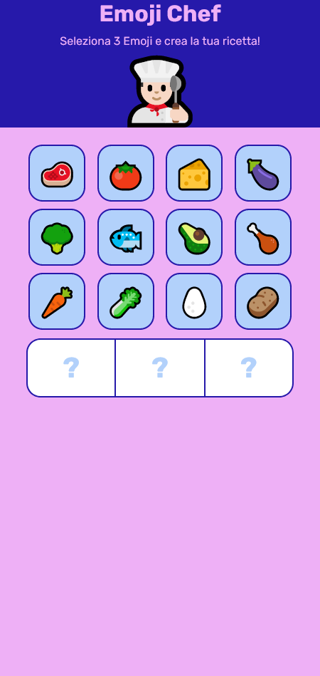
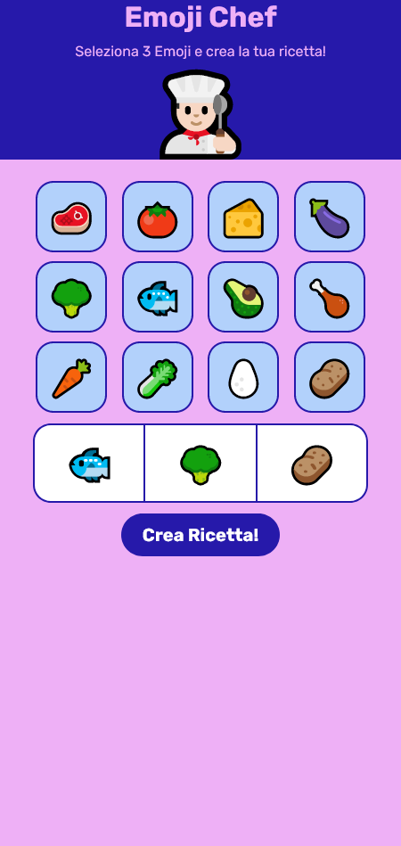

# Progetto - Emoji Chef

## Descrizione
Lo scopo del progetto è quello di creare un'app che, tramite l'utilizzo dell'intelligenza artificiale, sia in grado di generare semplici ricette a partire dagli ingredienti selezionati dall'utente tramite dei bottoni presenti a schermo.

La ricetta, generata interamente da zero interrogando le API di [OpenAI](https://platform.openai.com/docs/api-reference/introduction), viene creata sfruttando l'intelligenza artificiale GPT-3.5 ed è composta da:

- Un'immagine autogenerata utilizzando come prompt il titolo della ricetta.
- Un titolo per la ricetta generata.
- La lista di ingredienti necessari per la realizzazione del piatto in questione.
- Le istruzioni per la realizzazione della ricetta.

## Screenshot

## Costruito con:
- HTML
- CSS
- JavaScript
- AJAX

## Nota bene:
Per far funzionare il progetto, è necessario inserire la propria API Key personale (legata al proprio account di OpenAI) laddove indicato nel file "main.js".